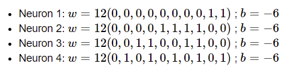
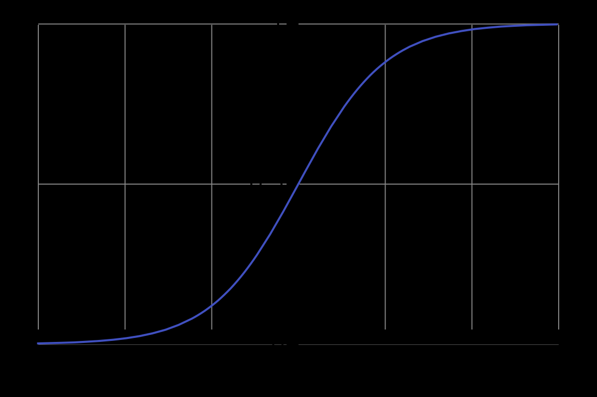

1.  a. Sigmoid neurons simulating perceptrons, part I
    Suppose we take all the weights and biases in a network of perceptrons, and multiply them by a positive constant, c>0. Show that the behaviour of the network doesn't change.

The perceptron is trying to see if wx+b>0. Multiplying by c doesn't change the sign of wx+b e.g. `+*+=+` and `-*+=-` so it also doesn't change whether or not each perceptron activates.

b. Sigmoid neurons simulating perceptrons, part II
Suppose we have the same setup as the last problem - a network of perceptrons. Suppose also that the overall input to the network of perceptrons has been chosen. We won't need the actual input value, we just need the input to have been fixed. Suppose the weights and biases are such that w⋅x+b≠0 for the input x to any particular perceptron in the network. Now replace all the perceptrons in the network by sigmoid neurons, and multiply the weights and biases by a positive constant c>0. Show that in the limit as c→∞ the behaviour of this network of sigmoid neurons is exactly the same as the network of perceptrons. How can this fail when w⋅x+b=0 for one of the perceptrons?

As c goes to infinity the negative neuron outputs will become ~0 and the positive neuron outputs will become ~1 (since that's how the sigmoid function behaves at its infinity limits/asymptotes). If wx+b=0 for one of the perceptrons, then lim -> inf would be 0.5 and that wouldn't behave the same as the perceptron which is either 0 or 1.

2. There is a way of determining the bitwise representation of a digit by adding an extra layer to the three-layer network above. The extra layer converts the output from the previous layer into a binary representation, as illustrated in the figure below. Find a set of weights and biases for the new output layer. Assume that the first 3 layers of neurons are such that the correct output in the third layer (i.e., the old output layer) has activation at least 0.99, and incorrect outputs have activation less than 0.01.

The weights are just the 4-bit binary representations e.g. the 4 weights coming out of the topmost neuron (representing 1) are 0001. The bias is -0.98 so that the threshold for firing is basically the weights times the inputs have to be greater than 0.98, which only happens when there is 0.99\*1 (the old output is activated and the corresponding weights coming out of that neuron are also 1).

Correction: basically the same answer as I said except it's with respect to the last layer so the weights are the matrix of binary representations but transposed e.g. for the example I gave 0001 but downwards (see below). The bias is set to -6 with a scaling factor of 12 because you want the 0.99 => close to 6 so that it saturates to 1 in the sigmoid function and 0.01 => close to -6 so it approaches 0.

3.  a. Prove the assertion of the last paragraph. Hint: If you're not already familiar with the Cauchy-Schwarz inequality, you may find it helpful to familiarize yourself with it.

$$ ΔC≈∇C⋅Δv $$
$$ ΔC≈∇C⋅-η∇C $$
$$ ΔC≈-∇C⋅(ϵ/∥∇C∥)⋅∇C $$
$$ ΔC≈-∇C⋅ϵ $$

Opposite direction of the gradient of C (-∇C) means moving in the direction of steepest descent.

Correction: Same ending equation but instead start with C-S inequality
$$ |∇C⋅Δv|<=||∇C||⋅||Δv|| $$

b. I explained gradient descent when C is a function of two variables, and when it's a function of more than two variables. What happens when C is a function of just one variable? Can you provide a geometric interpretation of what gradient descent is doing in the one-dimensional case?

Geometrically, if you have a positive derivative (+) at that point that means you should move left (-) (to move in the opposite direction so you continue moving down) and vise versa, if you have a negative derivative (-) you shouuld move right (+) in order to minimize the function.

4. An extreme version of gradient descent is to use a mini-batch size of just 1. That is, given a training input, x, we update our weights and biases according to the rules wk→w′k=wk−η∂Cx/∂wk and bl→b′l=bl−η∂Cx/∂bl. Then we choose another training input, and update the weights and biases again. And so on, repeatedly. This procedure is known as online, on-line, or incremental learning. In online learning, a neural network learns from just one training input at a time (just as human beings do). Name one advantage and one disadvantage of online learning, compared to stochastic gradient descent with a mini-batch size of, say, 20.

Advantage: faster gradient updates, can train and update model per sample when deployed live
Disadvantage: fluctuate a lot and may not take steps in the right direction for each step of gradient descent since it's only one sample; noisy

5. Write out Equation (22) a′=σ(wa+b) in component form, and verify that it gives the same result as the rule (4) for computing the output of a sigmoid neuron.

$$ a'_j=\sigma(\sum_{k=1}^{K}w\_{jk}a_k+b_j) $$

6. Try creating a network with just two layers - an input and an output layer, no hidden layer - with 784 and 10 neurons, respectively. Train the network using stochastic gradient descent. What classification accuracy can you achieve?

~83.3% for 30 epochs

`net = network.Network([784, 10]) net.SGD(training_data, 30, 10, 3.0, test_data=test_data)`
