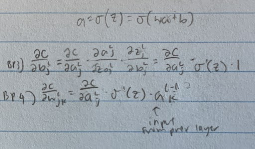

1. Alternate presentation of the equations of backpropagation: I've stated the equations of backpropagation (notably (BP1) and (BP2)) using the Hadamard product. This presentation may be disconcerting if you're unused to the Hadamard product. There's an alternative approach, based on conventional matrix multiplication, which some readers may find enlightening.

a. Show that (BP1) may be rewritten as
δL=Σ′(zL)∇aC,(33)
where Σ′(zL) is a square matrix whose diagonal entries are the values σ′(zLj), and whose off-diagonal entries are zero. Note that this matrix acts on ∇aC by conventional matrix multiplication.

They are the same because multiplying the gradient vector by the matrix of diagonals is the same as the hadamard product (each is multiplied with respective value at index j e.g. gradient at L_j is multiplied by corresponding sigma(zL_j)).

b. Show that (BP2) may be rewritten as
δl=Σ′(zl)(wl+1)Tδl+1.(34)

For the same reason, BP2 may be rewritten using the square matrix of zL times the vector w\*delta instead of the hadamard.

c. By combining observations (1) and (2) show that
δl=Σ′(zl)(wl+1)T…Σ′(zL−1)(wL)TΣ′(zL)∇aC(35)

Same thing except recursively replace delta (error) of previous layer (l+1 since moving right to left) with its written out form (BP2) in BP2 until you reach the final layer in which you replace the deltaL with BP1.

2. Prove Equations (BP3) and (BP4).

3. a. Backpropagation with a single modified neuron Suppose we modify a single neuron in a feedforward network so that the output from the neuron is given by f(∑jwjxj+b), where f is some function other than the sigmoid. How should we modify the backpropagation algorithm in this case?

Replace sigma' with f' for either BP1 or one of the BP2 (corresponding to the error backpropagating from the changed neuron).

b. Backpropagation with linear neurons Suppose we replace the usual non-linear σ function with σ(z)=z throughout the network. Rewrite the backpropagation algorithm for this case.

Replace sigma' with 1 for BP1 and BP2 (equivalent to removing the sigma' term).

1. Fully matrix-based approach to backpropagation over a mini-batch Our implementation of stochastic gradient descent loops over training examples in a mini-batch. It's possible to modify the backpropagation algorithm so that it computes the gradients for all training examples in a mini-batch simultaneously. The idea is that instead of beginning with a single input vector, x, we can begin with a matrix X=[x1x2…xm] whose columns are the vectors in the mini-batch. We forward-propagate by multiplying by the weight matrices, adding a suitable matrix for the bias terms, and applying the sigmoid function everywhere. We backpropagate along similar lines. Explicitly write out pseudocode for this approach to the backpropagation algorithm. Modify network.py so that it uses this fully matrix-based approach.

Understanding the code: Right now `network.py` is looping through each sample in the minibatch and adding up all of the nabla_b and nabla_w from the mini-batch to update the weights and biases. What we need to change is turning this loop into a vectorization i.e. do it all in one pass.

Pseudocode: Turn x into a matrix X of samples. Turn y into a matrix Y of corresponding labels. Turn w into a matrix of row j and column k for connection between k in previous layer to j in current layer and b into a vector with row j. For the forward pass, perform matrix multiplication with w\*activations+b.
