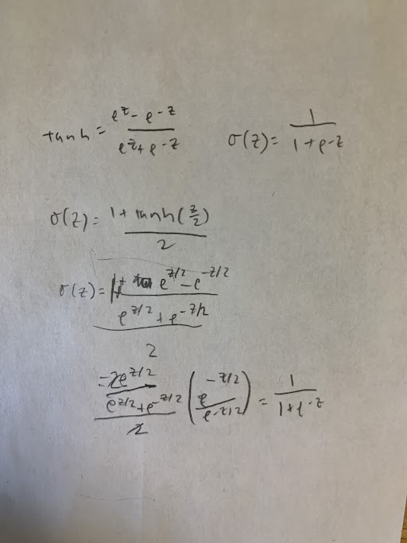

1. Verify that σ′(z)=σ(z)(1−σ(z))

σ(z)=1/(1+e−z)
$$ σ′(z)=-1(-e^-z)/(1+e^-z)^2 $$
$$ σ′(z)=e^-z/(1+e^-z)^2 = 1/(1+e^-z)\cdot e^-z/(1+e^-z)=σ(z)(1−σ(z))$$

This also makes sense because the logistic/sigmoid function models the rate of growth based on how far it is from the "carrying capacity" or in this case the horizontal asymptote of 1.

2. a. One gotcha with the cross-entropy is that it can be difficult at first to remember the respective roles of the ys and the as. It's easy to get confused about whether the right form is −[ylna+(1−y)ln(1−a)] or −[alny+(1−a)ln(1−y)]. What happens to the second of these expressions when y=0 or 1? Does this problem afflict the first expression? Why or why not?

When y=0 or 1, the loss becomes undefined since ln(0) will occur and ln is only defined for x>0. This doesn't happen with the first expression since a is the logit probability, which may get close to 0 or 1 but will never be exact as a binary label is.

Correction: More precisely, the sigmoid function squeezes a=sigmoid(z) to be between 0< a <1.

b. In the single-neuron discussion at the start of this section, I argued that the cross-entropy is small if σ(z)≈y for all training inputs. The argument relied on y being equal to either 0 or 1. This is usually true in classification problems, but for other problems (e.g., regression problems) y can sometimes take values intermediate between 0 and 1. Show that the cross-entropy is still minimized when σ(z)=y for all training inputs. When this is the case the cross-entropy has the value:
C=−1n∑x[ylny+(1−y)ln(1−y)].(64)
The quantity −[ylny+(1−y)ln(1−y)] is sometimes known as the binary entropy.

We want to find the minimum of
$$ C=yln(a)+(1-y)ln(1-a) $$
The partial derivative with respect to a is y/a-(1-y)/(1-a). Setting this to 0 to get the critical values gives a=y, which can be verified using the 2nd derivative to be the relative minimum (2nd derivative is greater than 0).

3. Many-layer multi-neuron networks In the notation introduced in the last chapter, show that for the quadratic cost the partial derivative with respect to weights in the output layer is
   ∂C∂wLjk=1n∑xaL−1k(aLj−yj)σ′(zLj).(65)
   The term σ′(zLj) causes a learning slowdown whenever an output neuron saturates on the wrong value. Show that for the cross-entropy cost the output error δL for a single training example x is given by
   δL=aL−y.(66)
   Use this expression to show that the partial derivative with respect to the weights in the output layer is given by
   ∂C∂wLjk=1n∑xaL−1k(aLj−yj).(67)
   The σ′(zLj) term has vanished, and so the cross-entropy avoids the problem of learning slowdown, not just when used with a single neuron, as we saw earlier, but also in many-layer multi-neuron networks. A simple variation on this analysis holds also for the biases. If this is not obvious to you, then you should work through that analysis as well.

To derive the error sigma_L, use the backpropagation equation which is the chain rule: ∂C/∂a*∂a/∂z = ∂C/∂a * σ'(z). The first term in this product is just the derivative of the cross entropy cost function with respect to a, so you get some fraction-fraction. Then you can replace the sigma' with sigma(1-sigma) (from the previous question) to get aL-y.

Plugging this into the partial derivatives for weights (a\*sigma) and biases (sigma) gives you a(a-y) and a-y respectively.

4. Using the quadratic cost when we have linear neurons in the output layer Suppose that we have a many-layer multi-neuron network. Suppose all the neurons in the final layer are linear neurons, meaning that the sigmoid activation function is not applied, and the outputs are simply aLj=zLj. Show that if we use the quadratic cost function then the output error δL for a single training example x is given by
   δL=aL−y.(68)
   Similarly to the previous problem, use this expression to show that the partial derivatives with respect to the weights and biases in the output layer are given by
   ∂C∂wLjk∂C∂bLj==1n∑xaL−1k(aLj−yj)1n∑x(aLj−yj).(69)(70)
   This shows that if the output neurons are linear neurons then the quadratic cost will not give rise to any problems with a learning slowdown. In this case the quadratic cost is, in fact, an appropriate cost function to use.

δL = ∂C/∂a\*∂a/∂z = -1/n*Σ(y-a) * 1 = a-y

This means that with linear neurons, since σ'(z) is 1, the output error is the same as the cross entropy loss function, or aL-y. If we plug this into the partial derivatives for cost and weights, we also get the same thing.

5. We've discussed at length the learning slowdown that can occur when output neurons saturate, in networks using the quadratic cost to train. Another factor that may inhibit learning is the presence of the xj term in Equation (61)
   ∂C∂wj=1n∑xxj(σ(z)−y)
   . Because of this term, when an input xj is near to zero, the corresponding weight wj will learn slowly. Explain why it is not possible to eliminate the xj term through a clever choice of cost function

∂C/∂wj = ∂C/∂a\*∂a/∂w. a is the sigmoid of the sum of the w\*x+b, so the derivative is x\*σ'(z) for a single sample. We construct the first term ∂C/∂a for cross entropy so that the σ'(z) cancels out, e.g. something/σ'(z). However, you can't cancel out the xj term because ∂C/∂a is only in terms of a, and you can't factor in x into this equation, since the cost only depends on the difference between a and y.

6. Construct an example showing explicitly that in a network with a sigmoid output layer, the output activations aLj won't always sum to 1.

The sigmoid function is 1/1+e^-z. This doesn't add up to 1 because it just maps each weighted sum to the sigmoid function, e.g. for z=0,0,0 the sum will be 1/2+1/2+1/2=1.5 not 1. Comparatively, the softmax layer would have e^0.5/(e^0.5+e^0.5+e^0.5) for each term, which does sum up to 1.

Correction: As another example, if you have only a single input and output neuron and one input x, then z=wx+b and sigmoid will be always be 0<a\<1, meaning that it will never sum to 1. However, the softmax has e^z/e^z=1.

7. Monotonicity of softmax Show that ∂aLj/∂zLk is positive if j=k and negative if j≠k. As a consequence, increasing zLj is guaranteed to increase the corresponding output activation, aLj, and will decrease all the other output activations. We already saw this empirically with the sliders, but this is a rigorous proof.

$$ a_j= \frac{e^z_j}{\Sigma_k e^z_k} $$

for a layer L.

$$ \frac{∂a_j}{∂z_k}= \frac{-e^z_j \cdot e^z_k}{{(\Sigma_k e^z_k)^2}} $$

Correction: Take the Sigma of k=/=j and k=j for the respective cases instead of the entire summation.

8. Non-locality of softmax A nice thing about sigmoid layers is that the output aLj is a function of the corresponding weighted input, aLj=σ(zLj). Explain why this is not the case for a softmax layer: any particular output activation aLj depends on all the weighted inputs.

All particular output activations depends on all of the weighted inputs because 1) the denominator includes a summation across all activations which results in 2) all of the activations get modified so that the output probabilities add up to 1.

Correction: Another way to see this is in delta a / delta z_k, because it is never 0, meaning that it will always change based on all weighted inputs and not just z_j.

9. Inverting the softmax layer Suppose we have a neural network with a softmax output layer, and the activations aLj are known. Show that the corresponding weighted inputs have the form zLj=lnaLj+C, for some constant C that is independent of j.

$$ a_j = \frac{e^z_j}{\Sigma_k e^z_k}$$
$$ ln(a_j)=z_j-z_k $$
$$ z_j=ln(a_j)+C $$

where C is z_k, the constant of all of the weighted sums added together.

10. Derive Equations (81) and (82).

$$ C=-ln(a_y^L) $$

$$ \frac{∂C}{∂b^L_j}= - \frac{1}{a^L_y}*σ'(z)*1 $$

$$=- \frac{1}{a^L_y}*a^L_y(y-a^L_y)=a^L_y-y $$

$$ \frac{∂C}{∂w^L_j}= a^(L-1)\_k(a^L_y-y) $$

11. Where does the "softmax" name come from? Suppose we change the softmax function so the output activations are given by
    aLj=eczLj∑keczLk,(83)
    where c is a positive constant. Note that c=1 corresponds to the standard softmax function. But if we use a different value of c we get a different function, which is nonetheless qualitatively rather similar to the softmax. In particular, show that the output activations form a probability distribution, just as for the usual softmax. Suppose we allow c to become large, i.e., c→∞. What is the limiting value for the output activations aLj? After solving this problem it should be clear to you why we think of the c=1 function as a "softened" version of the maximum function. This is the origin of the term "softmax".

The new function with c is still a probability distribution, but it weights higher activations even more if c>1 since they will grow much more rapidly than the other e^z_k's. In particular, when c=>inf, then the largest activation, or the max, will be the limiting value.

Correction: If you multiply by e^-cz, then you get 1/(1+summation(e^c(z_k-z_j))). If z_j is not the greatest term, then the limit of the denominator is inf and the softmax will be 0. If z_j is the maximum weighted and equal to z_k, then the expression z_k-z_j will be 0 and the softmax will be 1.

12. As discussed above, one way of expanding the MNIST training data is to use small rotations of training images. What's a problem that might occur if we allow arbitrarily large rotations of training images?

It might map back onto itself and cause overfitting.

Correction: A 6 is a 9 rotated 180 degrees (would confuse the classes).

13. Verify that the standard deviation of z=∑jwjxj+b in the paragraph above is 3/2−−−√. It may help to know that: (a) the variance of a sum of independent random variables is the sum of the variances of the individual random variables; and (b) the variance is the square of the standard deviation.

Since the std of the Gaussian is 1/sqrt(n_in), the variance for each of the weights is 1/n_in. Since there are n_in/2 weights that are set to 1 and the bias has a std and variance of 1, we get wx+b=(n_in/2)(1/n_in)+1=3/2. Taking the sqrt to get the std gives sqrt(3/2).

14. Connecting regularization and the improved method of weight initialization L2 regularization sometimes automatically gives us something similar to the new approach to weight initialization. Suppose we are using the old approach to weight initialization. Sketch a heuristic argument that: (1) supposing λ is not too small, the first epochs of training will be dominated almost entirely by weight decay; (2) provided ηλ≪n the weights will decay by a factor of exp(−ηλ/m) per epoch; and (3) supposing λ is not too large, the weight decay will tail off when the weights are down to a size around 1/n−−√, where n is the total number of weights in the network. Argue that these conditions are all satisfied in the examples graphed in this section.

L2 regularization: C=C0+λ/2n\*Sigma(w^2)
For weights: w→w=(1−ηλ/n)w−η/m∑x∂Cx/∂w

(1) Since the old approach to weight initialization had a large standard deviation, some of the weights will be very high, leading to weight decay having a very large effect. Also, the weights will shrink every epoch.

(2) When ηλ≪n, the weight decay looks a lot like the e^x function since you are multiplying (1−ηλ/n) per epoch and this will get raised to the power of close to 1, and it will decay by a factor of exp(−ηλ/m) per epoch.

(3) In the L2 regularization equation, if you solve for w, you find that it is proportional to 1/sqrt(n).

15. Modify the code above to implement L1 regularization, and use L1 regularization to classify MNIST digits using a 30 hidden neuron network. Can you find a regularization parameter that enables you to do better than running unregularized?

In network2_l1.py. Modified the weight update in SGD, ran with 30 layers in run.py (outperformed baseline without regularization).

16. Take a look at the Network.cost_derivative method in network.py. That method was written for the quadratic cost. How would you rewrite the method for the cross-entropy cost? Can you think of a problem that might arise in the cross-entropy version? In network2.py we've eliminated the Network.cost_derivative method entirely, instead incorporating its functionality into the CrossEntropyCost.delta method. How does this solve the problem you've just identified?

Instead of a-y for cost derivative of quadratic, cross entropy would have (1-y)/(1-a)-y/a which is the derivative of the cross entropy loss function. The problem with this is that the backpropagation equations need the delta a-y in order to compute the errors. The CrossEntropyCost.delta fixes this by implementing a-y and then using it for the backwards pass in SGD to compute cost.

Correction: Values of a very close to 0 or 1 leads to an undefined (inf) answer for cross entropy derivative, so we want to use the a-y formula for cost. It's also much more computationally inexpensive.

17. Modify network2.py so that it implements early stopping using a no-improvement-in-n epochs strategy, where n is a parameter that can be set.

In network2_early.py. My solution: `if all(evaluation_accuracy[-early_stopping_n] > evaluation_accuracy[-i] for i in range(1,early_stopping_n))`

Correction: Much more concise way is replacing `for j in range(epochs):` with `while (len(evaluation_accuracy) <= es or max(evaluation_accuracy[-es:]) > evaluation_accuracy[-es - 1]):`

18. Can you think of a rule for early stopping other than no-improvement-in-n? Ideally, the rule should compromise between getting high validation accuracies and not training too long. Add your rule to network2.py, and run three experiments comparing the validation accuracies and number of epochs of training to no-improvement-in-10.

Another way could be to monitor the derivative of the validation accuracy curve. If it is plateauing we would want to stop. However the problem with this is that accuracies are discrete; maybe we could monitor the deltas instead?

Correction: A better idea would be to monitor the rolling average of the validation accuracies, instead of just taking the max, to prevent one really good epoch from stopping too early. `while (len(evaluation_accuracy) <= 2 * es or sum(evaluation_accuracy[-es:]) > sum(evaluation_accuracy[-2*es:-es])):`

19. Modify network2.py so that it implements a learning schedule that: halves the learning rate each time the validation accuracy satisfies the no-improvement-in-10 rule; and terminates when the learning rate has dropped to 1/128 of its original value.

In network2_lr.py.

20. It's tempting to use gradient descent to try to learn good values for hyper-parameters such as λ and η. Can you think of an obstacle to using gradient descent to determine λ? Can you think of an obstacle to using gradient descent to determine η?

Lambda is added on to the cost function to penalize large weights, but if gradient descent wanted a lower cost, it would just set lambda to 0 instead of having the intended regularization effect. The learning rate affects how fast the weights and biases update and doesn't influence the cost function, so gradient descent wouldn't work for optimizing it.

21. What would go wrong if we used μ>1 in the momentum technique?
    What would go wrong if we used μ<0 in the momentum technique?

When μ>1, there is negative friction and the velocity increases. This could cause the "ball" (weights and biases) to overshoot minima. When μ<0, there is a ton of friction and velocity gets really small, which can cause learning to halt.

Correction: For μ<0, then v would oscillate between being positive and negative since it would cause it to change signs.

22. Add momentum-based stochastic gradient descent to network2.py.

In network2_momentum.py.

23. Prove the identity in Equation (111).

